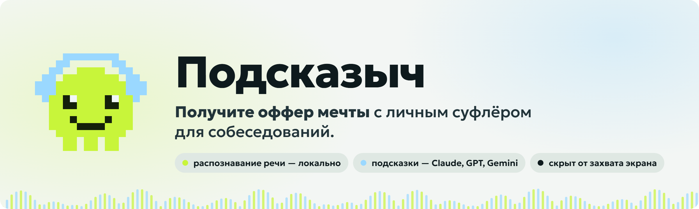
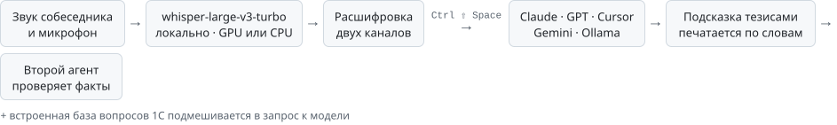
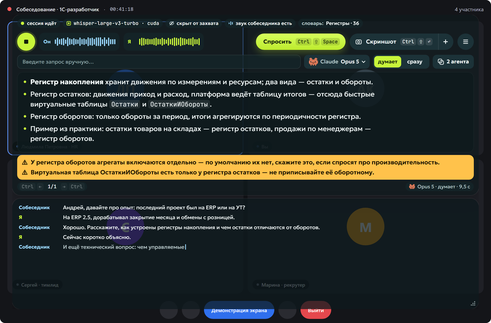
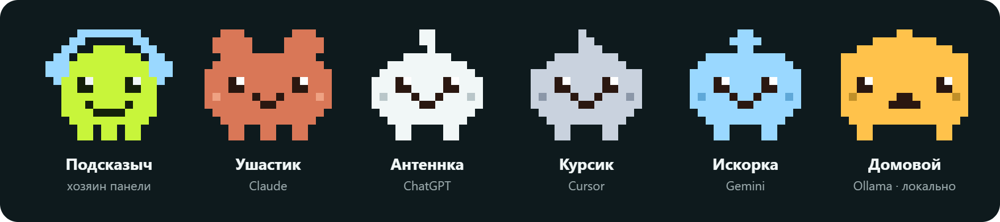
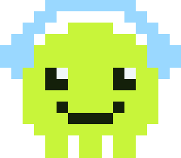

<p align="center">
  <picture>
    <source media="(prefers-color-scheme: dark)" srcset="assets/banner-dark.png">
    
  </picture>
</p>

<p align="center">
  <a href="https://github.com/xsander-karp0vich/podskazych/releases/latest/download/Podskazych-Setup-x64.exe">
    
  </a>
</p>

<p align="center">
  <a href="INSTALL.md">Инструкция по установке</a> · <a href="https://github.com/xsander-karp0vich/podskazych/releases/latest">Все файлы релиза</a>
</p>

<p align="center">
  
  
  
  
  
  
  
  
</p>

**Подсказыч** слушает созвон, распознаёт речь прямо на компьютере и по одной клавише подсказывает, что ответить. Панель висит поверх Zoom, Teams, Телемоста и Meet, не попадает в демонстрацию экрана и в запись.

Работает у всех. Распознавание речи идёт на видеокарте NVIDIA, а без неё — той же моделью на процессоре. Подсказки пишет модель, которая у вас уже есть: Claude, ChatGPT, Cursor или Gemini — через их официальные программы на вашей подписке, — либо локальная модель через Ollama без интернета.

> **Бесплатно и с открытым кодом.** Подсказыч ничего не продаёт и не берёт денег: ни подписки, ни аккаунта, ни своего сервера. Подсказки даёт та модель, за которую вы уже платите — подписка Claude, ChatGPT или Cursor, аккаунт Google, — или бесплатная локальная через Ollama. Распознавание речи работает на вашем компьютере и не стоит ничего.

## Как это работает

<picture>
  <source media="(prefers-color-scheme: dark)" srcset="assets/how-it-works-dark.svg">
  
</picture>

## Что умеет

- **Live coding по скриншоту.** Если на снимке экрана задача с кодом — тестовое, задачка на собеседовании, запрос, который просят написать, — ответ приходит не тезисами, а решением: сверху «Понял так» (проверьте, что задача прочитана верно) и фраза, которую можно сказать сразу; код разбит на смысловые куски, у каждого справа — что говорить, пока набираете его; внизу — что проверить перед отправкой и какие вопросы зададут следом. <kbd>Ctrl</kbd> <kbd>↓</kbd> отмечает набранную строку: она гаснет, следующая подсвечивается. Задача не влезла в один экран — <kbd>Ctrl</kbd> <kbd>⇧</kbd> <kbd>+</kbd> добавляет снимки в серию, до шести, и всё уходит одним вопросом.
- **Подсказка по разговору.** <kbd>Ctrl</kbd> <kbd>⇧</kbd> <kbd>Space</kbd> — модель читает расшифровку и отвечает 3–5 тезисами. Текст печатается по словам: читать можно с первого.
- **Модель на выбор.** Claude через Claude Code, ChatGPT через Codex CLI, Cursor через Cursor Agent, Gemini через Antigravity CLI или локальная модель через Ollama. Ключей Подсказыч не хранит: вы входите в официальную программу сервиса сами. Сервис и модель переключаются прямо в строке запроса, там же режим «думает» или «сразу».
- **Готовый ответ из базы — мгновенно.** В приложение встроена база из 982 вопросов с собеседований 1С. Если похожий вопрос уже есть в ней, ответ появляется сразу, пока собеседник договаривает. Модельный приходит следом.
- **Скриншот и разбор.** <kbd>Ctrl</kbd> <kbd>⇧</kbd> <kbd>↵</kbd> снимает экран: отчёт, ошибку, код. Код в ответе показан как в редакторе: подсветка, номера строк, отметка набранного.
- **Свой промпт и команды.** Встроенную инструкцию можно заменить своей — например, ролью кандидата на техническом собеседовании. Команды из промпта вида `/разбор` становятся кнопками в строке запроса: нажали — команда ушла модели вместе с расшифровкой.
- **Проверка вторым агентом.** Кнопка «2 агента» открывает рядом второе окно: агент — на той же или другой модели — сверяет факты подсказки с базой знаний и своими знаниями, по желанию — с интернетом. Тихое «проверено» или жёлтые уточнения, до того как ответ скажут вслух.
- **Расшифровка двух каналов.** Голубой — собеседник, лаймовый — вы. Словарь распознавания подстраивается под тему разговора, поэтому СКД, RLS и EnterpriseData не превращаются в набор звуков.
- **Живёт поверх всего и не мешает.** Прозрачность подложки, клики сквозь панель, скрытие одной клавишей, журнал созвонов на диске.

<p align="center">
  
</p>

## Видео-инструкция

Видео на 75 секунд: весь путь от скачивания до первой подсказки. Показано, как обойти предупреждение SmartScreen, подключить сервис одной командой в PowerShell и проверить, что подсказки работают. Сама установка займёт около пяти минут.

https://github.com/user-attachments/assets/ee2bf081-5539-4b82-b513-0c1094bd5ebb

## Установка

1. Нажмите **«Скачать для Windows»** вверху страницы и запустите `Podskazych-Setup-x64.exe`. Распознавание речи уже внутри: Python, модель Whisper и библиотеки для NVIDIA ставятся вместе с приложением.
2. Поставьте программу сервиса, которым хотите пользоваться, и войдите в неё — например, для Claude: `irm https://claude.ai/install.ps1 | iex`, затем `claude`.
3. Запустите Подсказыч, нажмите круглую кнопку, затем <kbd>Ctrl</kbd> <kbd>⇧</kbd> <kbd>Space</kbd>.

Нужны Windows 10 (2004+) или 11 x64, 8 ГБ памяти и 3 ГБ на диске. Видеокарта NVIDIA не обязательна: на ней фраза расшифровывается примерно за 0,2 с, на процессоре — за 1–2 с.

Подробно, с командами для каждого сервиса и ответами на частые проблемы, — в **[INSTALL.md](INSTALL.md)**.

## Горячие клавиши

| Действие | Клавиши |
| --- | --- |
| Спросить | <kbd>Ctrl</kbd> <kbd>⇧</kbd> <kbd>Space</kbd> |
| Скриншот экрана · отправить серию | <kbd>Ctrl</kbd> <kbd>⇧</kbd> <kbd>↵</kbd> |
| Снимок в серию | <kbd>Ctrl</kbd> <kbd>⇧</kbd> <kbd>+</kbd> |
| Старт / стоп сессии | <kbd>Ctrl</kbd> <kbd>⇧</kbd> <kbd>S</kbd> |
| Предыдущая / следующая подсказка | <kbd>Ctrl</kbd> <kbd>←</kbd> / <kbd>Ctrl</kbd> <kbd>→</kbd> |
| Скрыть или показать панель | <kbd>Ctrl</kbd> <kbd>⇧</kbd> <kbd>H</kbd> |
| Клики сквозь панель | <kbd>Ctrl</kbd> <kbd>⇧</kbd> <kbd>X</kbd> |
| Набранная строка решения | <kbd>Ctrl</kbd> <kbd>↓</kbd> / <kbd>Ctrl</kbd> <kbd>↑</kbd> |

Комбинации с <kbd>⇧</kbd> перехватываются на уровне системы и работают, даже когда в фокусе окно созвона. Если комбинацию уже занял другой процесс, приложение возьмёт запасную — с <kbd>Alt</kbd> вместо <kbd>⇧</kbd> или F-клавишу; какие достались, видно в настройках. Стрелки работают, когда в фокусе сама панель.

## Приватность

| Что | Где |
| --- | --- |
| **Остаётся на компьютере** | звук обоих каналов и распознавание речи — whisper работает локально; журнал созвонов — в папке данных приложения |
| **Уходит в выбранный сервис** | текст запроса к модели: расшифровка, ваш вопрос и найденное в базе; снимки экрана — только по кнопке «Скриншот» или «+»; запрос второму агенту, если он включён. С Ollama в сеть не уходит ничего |
| **Не хранится в приложении** | ключи и пароли сервисов: вход идёт через их собственные программы |
| **Не попадает в захват** | окно защищено от записи экрана: в Teams, Zoom, Телемосте и Meet панель не видна, скриншот окна не снять |

## Кто есть кто

В панели живёт маленькая пиксельная семья. Каждый зверёк — 16×14 клеток, и у каждого своя работа.

<p></p>

| Зверёк | Кто это |
| --- | --- |
| **Подсказыч** | Хозяин панели и лицо приложения. Лаймовый, в голубых наушниках — цвета двух каналов: лайм — вы, голубой — собеседник. Слушает разговор, оглядывается по сторонам, улыбается в тишине и шевелит губами, когда идёт сессия. Он же ведёт обучение при первом запуске и живёт в иконке. |
| **Ушастик** | Claude. Рыжий, с большими ушами — всё слышит. Сидит на кнопке модели и в подписи под ответом: задумывается, пока идёт ответ, печатает, когда текст пошёл, и грустно закрывает глаза, если ответ оборвался. Первый в семье: с него всё началось. |
| **Антеннка** | ChatGPT. Белая, с антенной на макушке — ловит сигнал через Codex CLI по вашей подписке ChatGPT. Появляется, когда подсказки пишет GPT. |
| **Курсик** | Cursor. Серо-стальной, с курсором-стрелкой вместо чуба. Отвечает через установленный Cursor Agent и может сам решить, какую модель взять. |
| **Искорка** | Gemini. Голубая, с искрой-ромбиком на голове. Работает через Antigravity CLI и ваш аккаунт Google. |
| **Домовой** | Локальная модель через Ollama. Янтарный, квадратный, с торчащим хохолком — никуда не выходит из дома: ни расшифровка, ни запрос не покидают компьютер. |

Зверьков в выборе модели легко различить: выбранный — цветной и с открытыми глазами, остальные спят серыми.

## Для разработчиков

Нужны [Node.js](https://nodejs.org) 22+, Python 3.12+ и Git. Видеокарта NVIDIA не обязательна.

```powershell
git clone https://github.com/xsander-karp0vich/podskazych.git
cd podskazych
npm install                                                     # приложение
python -m venv sidecar\.venv                                    # окружение распознавания речи
sidecar\.venv\Scripts\pip install -r sidecar\requirements.txt
sidecar\.venv\Scripts\python sidecar\fetch_model.py             # веса whisper, ~1,6 ГБ
npm run dev
```

Проверки: `npm run typecheck`, `npm test`, `npm run kb:check`.

Установщик собирается командой `npm run dist`: она проверяет встроенную базу вопросов, собирает переносимое окружение Python с моделью в `build/stt` (`scripts/build-stt-runtime.ps1`) и упаковывает всё в `dist/Podskazych-Setup-x64.exe`.

Необязательные переменные окружения:

| Переменная | Зачем |
| --- | --- |
| `ANTHROPIC_API_KEY` | Claude через API по ключу вместо Claude Code |
| `HTTPS_PROXY` | прокси для запросов к моделям |
| `OLLAMA_HOST` | адрес Ollama, если не `127.0.0.1:11434` |
| `COPILOT_STT_DEVICE` | `cpu` — принудительно распознавать на процессоре, `cuda` — только на видеокарте |
| `COPILOT_PYTHON`, `COPILOT_MODEL` | свой Python и своя папка с весами whisper |

## Структура репозитория

```
src/main/        Electron: окно, горячие клавиши, второй агент, база знаний, распознавание
src/main/llm/    провайдеры: Claude Code, Codex, Cursor (ACP), Antigravity, Ollama, Anthropic API
src/renderer/    React: панель, сцена ответа, выбор модели, меню, настройки, обучение
src/shared/      общие типы, настройки, каталог провайдеров, разбор ответа модели
kb/              встроенная база вопросов 1С: questions.jsonl и паспорт manifest.json
sidecar/         Python: захват системного звука, Silero VAD и whisper
scripts/         сборка окружения распознавания, иконки, проверка базы
tests/           тесты разбора протоколов и настроек
build/           иконки и ресурсы установщика
DESIGN.md        дизайн-спецификация: токены, компоненты, движение
PRODUCT.md       продуктовое описание и сценарии
INSTALL.md       установка для пользователей
```

## Дизайн

Тёмная сине-зелёная подложка; лайм — «я» и мои действия, голубой — собеседник, янтарь — уточнения, коралл — ошибки. Прозрачна только подложка, текст всегда непрозрачный. Подробности — в [DESIGN.md](DESIGN.md).

<p>
  
  
  
  
  
</p>

## Лицензия

[MIT](LICENSE) — используйте, меняйте, распространяйте. Это касается кода и базы вопросов. Шрифты Geologica, Golos Text и JetBrains Mono — [SIL Open Font License 1.1](src/renderer/public/fonts/OFL.txt). Модель whisper-large-v3-turbo — MIT, © OpenAI.

Подсказыч не связан с Anthropic, OpenAI, Google, Cursor или Ollama: это независимый клиент к их моделям по вашей подписке, работающий через их официальные программы. Названия сервисов — товарные знаки их владельцев.

<p align="center"></p>
